# CRM Subscriptions Module

This documentation describes API handlers provided by this module for
others to use. It expects your application is based on the [CRM skeleton](https://github.com/remp2020/crm-skeleton)
provided by us.

## Installing module

We recommend using Composer for installation and update management.

```shell
composer require remp/crm-subscriptions-module
```

## Enabling module

Add installed extension to your `app/config/config.neon` file.

```neon
extensions:
	- Crm\SubscriptionsModule\DI\SubscriptionsModuleExtension
```

## Widgets

Widgets are small reusable components that can be used on different places within CRM. Module can provide widget placeholders for other modules to populate or widget implementations.

### Available widgets

#### `SubscribersWithMissingAddressWidget`

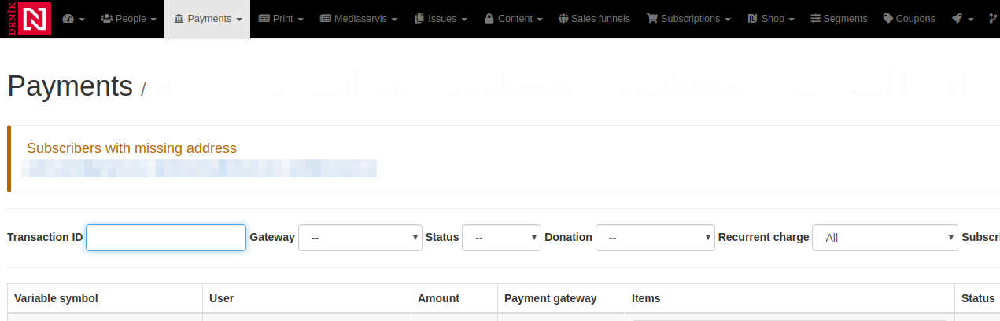

Widget displays list of all subscribers with specified content access that don't have specified address type entered in the system. It is placed at the `admin.payments.top` placeholder, above the payments listing.

By default the widget displays all `print` subscribers without `print` address type entered. You can change the configuration in your `config.local.neon` and check different content access names against different address types:

```neon
subscribersWithMissingAddressWidget:
    setup:
        - setContentAccessNames(print, print_friday)
        - setAddressTypes(print, print_other)
```

### Available placeholders

These are widget placeholders provided by Payments Module. You can register your own widgets to be displayed at following places:

* `admin.payments.top`
* `payments.banktransfer.right`
* `payments.admin.payment_source_listing`
* `payments.admin.payment_item_listing`
* `payments.frontend.payments_my.top`
* `payments.arpu.bottom`

## API documentation

All examples use `http://crm.press` as a base domain. Please change the host to the one you use
before executing the examples.

All examples use `XXX` as a default value for authorization token, please replace it with the
real tokens:

* *API tokens.* Standard API keys for server-server communication. It identifies the calling application as a whole.
They can be generated in CRM Admin (`/api/api-tokens-admin/`) and each API key has to be whitelisted to access
specific API endpoints. By default the API key has access to no endpoint. 
* *User tokens.* Generated for each user during the login process, token identify single user when communicating between
different parts of the system. The token can be read:
    * From `n_token` cookie if the user was logged in via CRM.
    * From the response of [`/api/v1/users/login` endpoint](https://github.com/remp2020/crm-users-module#post-apiv1userslogin) -
    you're free to store the response into your own cookie/local storage/session.

API responses can contain following HTTP codes:

| Value | Description |
| --- | --- |
| 200 OK | Successful response, default value | 
| 400 Bad Request | Invalid request (missing required parameters) | 
| 403 Forbidden | The authorization failed (provided token was not valid) | 
| 404 Not found | Referenced resource wasn't found | 

If possible, the response includes `application/json` encoded payload with message explaining
the error further.

---

#### GET `/api/v1/users/subscriptions`

Returns all user subscriptions with information when they start/end and which content type they give an access to.

##### *Headers:*

| Name | Value | Required | Description |
| --- | --- | --- | --- |
| Authorization | Bearer *String* | yes | User token. |

##### *Params:*

| Name | Value | Required | Description |
| --- |---| --- | --- |
| show_finished | *Boolean* | no | Flag indicating whether to include finished subscriptions or not. If not provided, only active and future subscriptions are returned.  |


##### *Example:*

```shell
curl -X POST \
  http://crm.press/api/v1/users/subscriptions \
  -H 'Authorization: Bearer XXX' \
  -H 'Content-Type: application/x-www-form-urlencoded'
```

Response:

```json5
{
    "status": "ok",
    "subscriptions": [ // Array; list of subscriptions
        {
            "start_at": "2019-01-15T00:00:00+01:00", // String; RFC3339 encoded start time
            "end_at": "2020-01-15T00:00:00+01:00", // String; RFC3339 encoded end time
            "code": "web_year", // String; subscription code (slug)
            "access": [ // Array: list of all types of content subscription includes
                "web" // String; name of the content type
            ]
        },
        {
            "start_at": "2019-03-05T00:00:00+01:00",
            "end_at": "2019-03-19T00:00:00+01:00",
            "code": "mobile-welcome-action",
            "access": [
                "web",
                "mobile"
            ]
        }
    ]
}
```

---

#### POST `/api/v1/subscriptions/create`

Creates new subscription for given user and returns new instance.

##### *Headers:*

| Name | Value | Required | Description |
| --- | --- | --- | --- |
| Authorization | Bearer *String* | yes | Bearer token. |

##### *Params:*

| Name | Value | Required | Description |
| --- |---| --- | --- |
| email | *String* | yes | Email of existing user. |
| subscription_type_id | *String* | yes | ID of subscription type to use. List of all subscription types is available at `/subscriptions/subscription-types-admin`. |
| start_time | *String* | no | RFC3339 formatted start time. If not present, subscription will start immediately. |
| type | *String* | yes | Type of subscription - values allowed: `regular`, `free`, `donation`, `gift`, `special`, `upgrade`, `prepaid`. If not provided, defaults to `regular`. |


##### *Example:*

```shell
curl -X POST \
  http://crm.press/api/v1/subscriptions/create \
  -H 'Authorization: Bearer XXX' \
  -H 'Content-Type: application/x-www-form-urlencoded' \
  -d 'email=user%40user.sk&subscription_type_id=73'
```

Response:

```json5
{
    "status": "ok",
    "message": "Subscription created",
    "subscriptions": {
        "id": 628893, // string; ID of new subscription 
        "start_time": "2019-03-08T13:35:05+01:00", // String; RFC3339 formatted start time of subscription
        "end_time": "2019-05-09T13:35:05+02:00" // String; RFC3339 formatted end time of subscription
    }
}
```

## Components

**ActualSubscribersRegistrationSourceStatsWidget**

Admin dashboard stats graph widget.

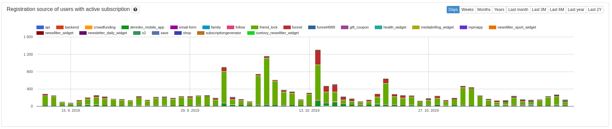

[Source code](https://github.com/remp2020/crm-subscriptions-module/blob/7f5c0f97ad3b0effc0d49326fb35dabcad300d98/src/components/ActualSubscribersRegistrationSourceStatsWidget/ActualSubscribersRegistrationSourceStatsWidget.php#L1)

[How to use](https://github.com/remp2020/crm-subscriptions-module/blob/7f5c0f97ad3b0effc0d49326fb35dabcad300d98/src/SubscriptionsModule.php#L123)

**ActualSubscribersStatWidget**

Admin dashboard stats widget.

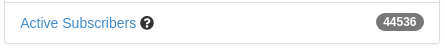

[Source code](https://github.com/remp2020/crm-subscriptions-module/blob/7f5c0f97ad3b0effc0d49326fb35dabcad300d98/src/components/ActualSubscribersStatWidget/ActualSubscribersStatWidget.php#L1)

[How to use](https://github.com/remp2020/crm-subscriptions-module/blob/7f5c0f97ad3b0effc0d49326fb35dabcad300d98/src/SubscriptionsModule.php#L118)

**ActualSubscriptionLabel**

Admin user listing component.

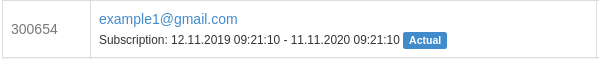

[Source code](https://github.com/remp2020/crm-subscriptions-module/blob/7f5c0f97ad3b0effc0d49326fb35dabcad300d98/src/components/ActualSubscriptionLabel/ActualSubscriptionLabel.php#L1)

[How to use](https://github.com/remp2020/crm-subscriptions-module/blob/7f5c0f97ad3b0effc0d49326fb35dabcad300d98/src/SubscriptionsModule.php#L163)

**ActualSubscriptionsStatWidget**

Admin dashboard actual subscriptions count widget.

[Source code](https://github.com/remp2020/crm-subscriptions-module/blob/7f5c0f97ad3b0effc0d49326fb35dabcad300d98/src/components/ActualSubscriptionsStatWidget/ActualSubscriptionsStatWidget.php#L1)

**ActualUserSubscriptions**

Admin user detail stats widget.

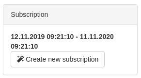

[Source code](https://github.com/remp2020/crm-subscriptions-module/blob/7f5c0f97ad3b0effc0d49326fb35dabcad300d98/src/components/ActualUserSubscriptions/ActualUserSubscriptions.php#L1)

[How to use](https://github.com/remp2020/crm-subscriptions-module/blob/7f5c0f97ad3b0effc0d49326fb35dabcad300d98/src/SubscriptionsModule.php#L108)

**EndingSubscriptionsWidget**

Admin ending subscriptions listing widget.

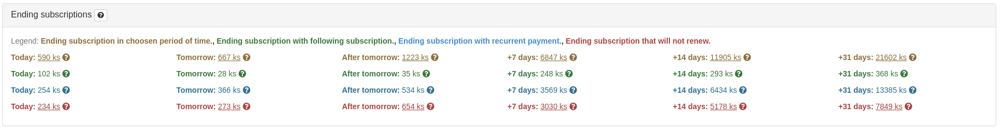

[Source code](https://github.com/remp2020/crm-subscriptions-module/blob/7f5c0f97ad3b0effc0d49326fb35dabcad300d98/src/components/EndingSubscriptionsWidget/EndingSubscriptionsWidget.php#L1)

[How to use](https://github.com/remp2020/crm-subscriptions-module/blob/7f5c0f97ad3b0effc0d49326fb35dabcad300d98/src/SubscriptionsModule.php#L143)

**MonthSubscriptionsSmallBarGraphWidget**

Admin users header graph widget.

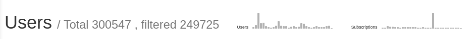

[Source code](https://github.com/remp2020/crm-subscriptions-module/blob/7f5c0f97ad3b0effc0d49326fb35dabcad300d98/src/components/MonthSubscriptionsSmallBarGraphWidget/MonthSubscriptionsSmallBarGraphWidget.php#L1)

[How to use](https://github.com/remp2020/crm-subscriptions-module/blob/7f5c0f97ad3b0effc0d49326fb35dabcad300d98/src/SubscriptionsModule.php#L158)

**MonthSubscriptionStatWidget**

Admin dashboard single stat widget.

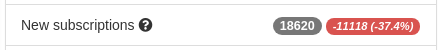

[Source code](https://github.com/remp2020/crm-subscriptions-module/blob/7f5c0f97ad3b0effc0d49326fb35dabcad300d98/src/components/MonthSubscriptionStatWidget/MonthSubscriptionsStatWidget.php#L1)

**MonthToDateSubscriptionStatWidget**

Admin dashboard single stat widget.

[Source code](https://github.com/remp2020/crm-subscriptions-module/blob/7f5c0f97ad3b0effc0d49326fb35dabcad300d98/src/components/MonthToDateSubscriptionStatWidget/MonthToDateSubscriptionsStatWidget.php#L1)

**PrintSubscribersWithoutPrintAddressWidget**

Admin payments listing header widget.

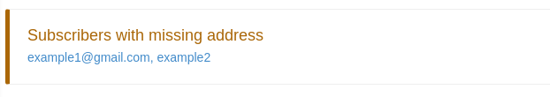

[Source code](https://github.com/remp2020/crm-subscriptions-module/blob/7f5c0f97ad3b0effc0d49326fb35dabcad300d98/src/components/PrintSubscribersWithoutPrintAddressWidget/SubscribersWithMissingAddressWidget.php#L1)

[How to use](https://github.com/remp2020/crm-subscriptions-module/blob/7f5c0f97ad3b0effc0d49326fb35dabcad300d98/src/SubscriptionsModule.php#L168)

**RenewedSubscriptionsEndingWithinPeriodWidget**

Admin dashboard stats widget.


[Source code](https://github.com/remp2020/crm-subscriptions-module/blob/7f5c0f97ad3b0effc0d49326fb35dabcad300d98/src/components/RenewedSubscriptionsEndingWithinPeriodWidget/RenewedSubscriptionsEndingWithinPeriodWidget.php#L1)

[How to use](https://github.com/remp2020/crm-subscriptions-module/blob/7f5c0f97ad3b0effc0d49326fb35dabcad300d98/src/SubscriptionsModule.php#L153)

**SubscriptionButton**

Admin listing edit subscription button widget.

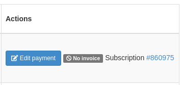

[Source code](https://github.com/remp2020/crm-subscriptions-module/blob/7f5c0f97ad3b0effc0d49326fb35dabcad300d98/src/components/SubscriptionButton/SubscriptionButton.php#L1)

[How to use](https://github.com/remp2020/crm-subscriptions-module/blob/7f5c0f97ad3b0effc0d49326fb35dabcad300d98/src/SubscriptionsModule.php#L103)

**SubscriptionEndsStats**

Admin ending subscriptions types and content access listing component.

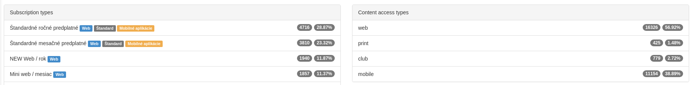

[Source code](https://github.com/remp2020/crm-subscriptions-module/blob/7f5c0f97ad3b0effc0d49326fb35dabcad300d98/src/components/SubscriptionEndsStats/SubscriptionEndsStats.php#L1)

[How to use](https://github.com/remp2020/crm-subscriptions-module/blob/7f5c0f97ad3b0effc0d49326fb35dabcad300d98/src/presenters/DashboardPresenter.php#L237)

**SubscriptionsEndingWithinPeriodWidget**

Admin dashboard ending subscriptions stats widget.

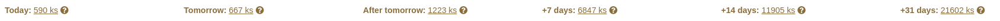

[Source code](https://github.com/remp2020/crm-subscriptions-module/blob/7f5c0f97ad3b0effc0d49326fb35dabcad300d98/src/components/SubscriptionsEndingWithinPeriodWidget/SubscriptionsEndingWithinPeriodWidget.php#L1)

[How to use](https://github.com/remp2020/crm-subscriptions-module/blob/7f5c0f97ad3b0effc0d49326fb35dabcad300d98/src/SubscriptionsModule.php#L148)

**TodaySubscriptionsStatWidget**

Admin dashboard single stat widget.

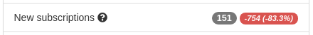

[Source code](https://github.com/remp2020/crm-subscriptions-module/blob/7f5c0f97ad3b0effc0d49326fb35dabcad300d98/src/components/TodaySubscriptionsStatWidget/TodaySubscriptionsStatWidget.php#L1)

[How to use](https://github.com/remp2020/crm-subscriptions-module/blob/7f5c0f97ad3b0effc0d49326fb35dabcad300d98/src/SubscriptionsModule.php#L128)

**TotalSubscriptionsStatWidget**

Admin dashboard single stat widget.

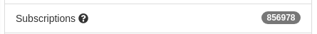

[Source code](https://github.com/remp2020/crm-subscriptions-module/blob/7f5c0f97ad3b0effc0d49326fb35dabcad300d98/src/components/TotalSubscriptionsStatWidget/TotalSubscriptionsStatWidget.php#L1)

[How to use](https://github.com/remp2020/crm-subscriptions-module/blob/7f5c0f97ad3b0effc0d49326fb35dabcad300d98/src/SubscriptionsModule.php#L113)

**UserSubscriptions**

Admin user detail subscriptions listing widget.

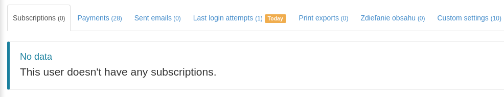

[Source code](https://github.com/remp2020/crm-subscriptions-module/blob/7f5c0f97ad3b0effc0d49326fb35dabcad300d98/src/components/UserSubscriptions/UserSubscriptionsListing.php#L1)

[How to use](https://github.com/remp2020/crm-subscriptions-module/blob/7f5c0f97ad3b0effc0d49326fb35dabcad300d98/src/SubscriptionsModule.php#L98)
